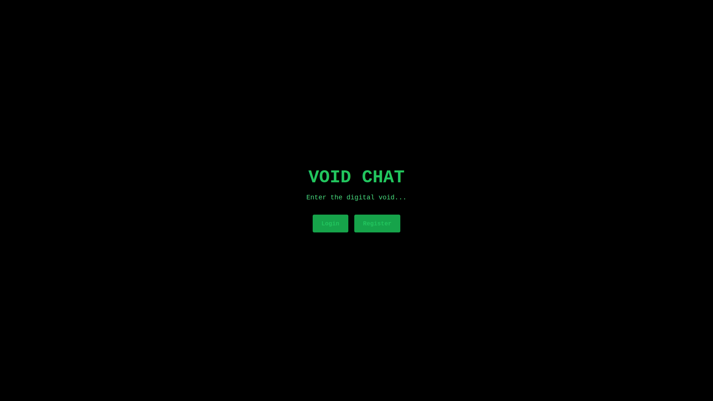
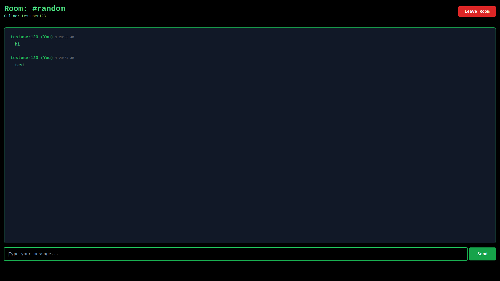

# 💬 Void Chat - Real-time Chat Application


A modern, real-time chat application built with React.js and Firebase. Connect with users instantly in multiple chat rooms with a sleek, responsive interface.

## 🌐 Live Demo

**[View Live App](https://void-chat-2393b.web.app)**

## ✨ Features

- 🔐 **Secure Authentication** - User registration and login with Firebase Auth
- 💬 **Real-time Messaging** - Instant message delivery across all users
- 🏠 **Multiple Chat Rooms** - Create and join different chat rooms
- 👥 **Online Users** - See who's currently active in each room
- ⏰ **Message Timestamps** - Track when messages were sent
- 🎨 **Modern UI** - Clean, responsive design with Tailwind CSS
- 📱 **Mobile Responsive** - Works seamlessly on all devices

## 🛠️ Tech Stack

### Frontend
- **React.js** - JavaScript library for building user interfaces
- **React Router** - Client-side routing
- **Tailwind CSS** - Utility-first CSS framework

### Backend & Services
- **Firebase Authentication** - Secure user authentication
- **Firebase Realtime Database** - Real-time data synchronization
- **Firebase Hosting** - Fast and secure web hosting

## 📂 Project Structure
```
void-chat/
├── src/
│   ├── components/      # Reusable components
│   ├── context/         # React context (Auth)
│   ├── pages/           # Page components
│   │   ├── Welcome.js
│   │   ├── Login.js
│   │   ├── Register.js
│   │   ├── Chatroom.js
│   │   └── Chat.js
│   ├── firebase.js      # Firebase configuration
│   ├── App.js           # Main app component
│   ├── index.js         # Entry point
│   └── index.css        # Global styles
├── public/              # Static files
├── .gitignore
├── package.json
└── README.md
```

## 🚀 Getting Started

### Prerequisites

- Node.js (v14 or higher)
- npm or yarn
- Firebase account

### Installation

1. **Clone the repository**
```bash
   git clone https://github.com/YOUR_USERNAME/void-chat.git
   cd void-chat
```

2. **Install dependencies**
```bash
   npm install
```

3. **Set up Firebase**
   - Create a new Firebase project at [Firebase Console](https://console.firebase.google.com/)
   - Enable Authentication (Email/Password)
   - Enable Realtime Database
   - Copy your Firebase config

4. **Configure Firebase**
   
   Update `src/firebase.js` with your Firebase configuration:
```javascript
   const firebaseConfig = {
     apiKey: "YOUR_API_KEY",
     authDomain: "YOUR_AUTH_DOMAIN",
     projectId: "YOUR_PROJECT_ID",
     storageBucket: "YOUR_STORAGE_BUCKET",
     messagingSenderId: "YOUR_SENDER_ID",
     appId: "YOUR_APP_ID"
   };
```

5. **Set up Firebase Realtime Database Rules**
   
   Go to Firebase Console → Realtime Database → Rules:
```json
   {
     "rules": {
       "chatrooms": {
         "$roomId": {
           ".read": "auth != null",
           ".write": "auth != null"
         }
       },
       "users": {
         "$userId": {
           ".read": "auth != null",
           ".write": "$userId === auth.uid"
         }
       }
     }
   }
```

6. **Run the development server**
```bash
   npm start
```

   Open [http://localhost:3000](http://localhost:3000) to view it in your browser.

## 📦 Build for Production
```bash
npm run build
```

This creates an optimized production build in the `build` folder.

## 🚢 Deployment

### Deploy to Firebase Hosting

1. **Install Firebase CLI**
```bash
   npm install firebase-tools
```

2. **Login to Firebase**
```bash
   npx firebase login
```

3. **Initialize Firebase Hosting**
```bash
   npx firebase init hosting
```

4. **Build and Deploy**
```bash
   npm run build
   npx firebase deploy
```

## 🎯 Usage

1. **Register** a new account with email and password
2. **Login** to access the chatroom lobby
3. **Create or Join** a chat room
4. **Start chatting** with other users in real-time!

## 📸 Screenshots

### Welcome Page


### Chat Room


## 🔮 Future Enhancements

- [ ] Private chat rooms with passwords
- [ ] Direct messaging between users
- [ ] Image and file sharing
- [ ] Emoji support
- [ ] Typing indicators
- [ ] Message reactions
- [ ] User profiles with avatars
- [ ] Dark/Light theme toggle
- [ ] Message search
- [ ] Push notifications

## 🤝 Contributing

Contributions are welcome! Please feel free to submit a Pull Request.

1. Fork the project
2. Create your feature branch (`git checkout -b feature/AmazingFeature`)
3. Commit your changes (`git commit -m 'Add some AmazingFeature'`)
4. Push to the branch (`git push origin feature/AmazingFeature`)
5. Open a Pull Request

## 📝 License

This project is licensed under the MIT License - see the [LICENSE](LICENSE) file for details.

## 👨‍💻 Author

**Your Name**
- GitHub: [Hozyfa Batisha](https://github.com/Hozyfa-Batisha)
- Email: Hozyfabatisha@gmail.com

## 🙏 Acknowledgments

- Built with [React](https://reactjs.org/)
- Powered by [Firebase](https://firebase.google.com/)
- Styled with [Tailwind CSS](https://tailwindcss.com/)

## 📞 Support

For support, email Hozyfabatisha@gmail.com or open an issue in this repository.

---

⭐ **If you like this project, please give it a star!** ⭐
